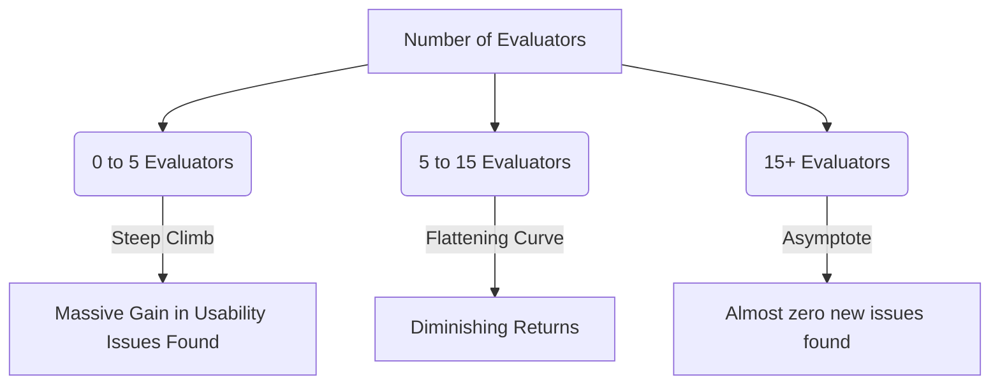

[[01. Introduction - Part 1]] [[02. Introduction - Part 2]] [[03. Introduction - Part 3]]
> [!summary]
> 
>Heuristics are theoretically grounded guidelines used to evaluate user interfaces. This document synthesizes both the formal written materials and the expanded lecture transcript, detailing the evolution of HCI evaluation, the subjective nature of usability, and the specific application of expert evaluation methods.

> [!tldr]
> 
> Learn Nielsen's 10 Heuristics, Shneiderman's 8 Golden Rules, and why you need exactly 3 to 5 expert evaluators to find the majority of usability problems without over-investing or under-investing in the evaluation process.

---

## 1. Introduction to Usability Evaluation

Before diving into specific rules, it is vital to understand why we need heuristics in the first place. In traditional software engineering, evaluating performance, security, or availability relies on concrete, objective metrics. For example, you might measure the number of sessions per instance or the number of failed access attempts. These are straightforward measurements where a higher or lower value definitively indicates better system support.

However, usability evaluation is inherently vague and subjective. It draws heavily from psychology, ergonomics, cognitive processing, and individual work habits. With nearly 7 billion people potentially interacting with systems in unique ways, evaluating an interface requires tangible mechanisms to determine if a design is "good" (above standard) or "better" (when comparing Option A versus Option B).

> [!info]
> 
> Info: The two major ways to evaluate systems in HCI are User Studies and Expert Evaluation. This is analogous to algorithmic costing versus expert opinion in software project management.

> [!question]
> 
> Q: What are heuristics in the context of this lesson?
> 
> A: Heuristics are theoretically grounded guidelines and principles used to evaluate user interfaces. They are sometimes referred to as heuristic evaluations.

Unlike physical laws (such as Newton's Laws of Motion or the First Law of Thermodynamics) which behave consistently under specific conditions universally, HCI lacks absolute laws. Instead, HCI relies on grouped success stories and patterns observed over extensive testing. When you cluster these successful interactions together, you form rulesets or guidelines, which we call heuristics.

---

## 2. Theoretical vs. Practical Guidelines

There are countless heuristics, guidelines, and principles in the field of design. They generally fall into two distinct categories:

1. Theoretically Grounded Heuristics: Broad, universal principles tested across various domains (e.g., Nielsen's heuristics).
    
2. Practical / Vendor-Specific Guidelines: Highly prescriptive, vendor-centered rules tailored to a specific operating system or environment.
    

> [!question]
> 
> Q: How do theoretical heuristics differ from vendor-specific guidelines?
> 
> A: Theoretically grounded heuristics are general principles, while vendor-specific guidelines (such as the Mac OS X Human Interface Guidelines or Microsoft Official User Interface Guidelines) are highly practical, more prescriptive, and obviously vendor-centered.

> [!example]
> 
> Example from Lecture: Apple's macOS Human Interface Guidelines will not teach you how to design for a Microsoft Windows environment. They are exclusive to their platform and act like a doctor's prescription—you must follow them strictly to integrate into their ecosystem, whether you personally agree with them or not. Conversely, Microsoft will not instruct its developers on how to build Apple-style interfaces.

---

## 3. The Two Prominent Sets of Heuristics

> [!todo]
> 
> Study Point: You will be expected to be able to explain and apply both of these sets of heuristics perfectly.

> [!question]
> 
> Q: Which two prominent sets of heuristics are the main focus of this module?
> 
> A: The course focuses on Nielsen's (1994) list of ten heuristics and Shneiderman and Plaisant's (2010) list of eight golden rules. Students are expected to be able to explain and apply both sets.

### 3.1 Nielsen's 10 Heuristics (1994)

Introduced by Jakob Nielsen—a pioneer who had been working on these concepts since the 1980s—in his book Usability Engineering (1994). This list is highly prioritized and hierarchical, meaning the earlier rules carry significantly more historical weight than the later ones.

> [!question]
> 
> Q: What are Nielsen’s (1994) ten heuristics from the book Usability Engineering?
> 
> A: Nielsen's ten heuristics are:
> 
> 1. Visibility of system status
>     
> 2. Match between system and the real world
>     
> 3. User control and freedom
>     
> 4. Consistency and standards
>     
> 5. Error prevention
>     
> 6. Recognition rather than recall
>     
> 7. Flexibility and efficiency of use
>     
> 8. Aesthetic and minimalist design
>     
> 9. Help users recognize, diagnose, and recover from errors
>     
> 10. Help and documentation.
>     

Detailed Breakdown & Lecture Insights:

- 1. Visibility of System Status: In the 1990s, systems would often hang or crash without telling the user. Users would wait endlessly, assume the system broke, and eventually kill the process. Nielsen mandated that the system must show its state. Lecture Note: Simply throwing an unformatted stack trace or raw exception to the UI technically satisfies "visibility," but it is poor design because it lacks informative value for the average user.
    
- 2. Match between system and the real world: The computer should act as a transparent facilitator. Lecture Example: Think of a modern Zoom call. If the audio and video sync perfectly, you forget the computer is there and feel like you are naturally talking to someone. If there is lag, the illusion shatters. The system must feel ubiquitous and natural, utilizing gestures and flows that mimic real-life interactions.
    
- 3. User control and freedom: Early command-line terminals did not offer flexibility; you just followed strict commands. Users make mistakes; they need to easily revert actions without feeling trapped by an unforgiving system flow.
    
- 4. Consistency and standards: Using the same color themes, font styles, and layouts ensures users feel comfortable and don't have to relearn interfaces per screen.
    
- 5. Error prevention: It's better to prevent a problem from occurring in the first place. Lecture Example: Implementing input validation that physically prevents a user from typing letters into a telephone number field.
    
- 6. Recognition rather than recall: Utilizing the brain's short-term memory limits. It is much easier and less fatiguing to recognize a visual icon (like a floppy disk to save) than to recall and type out a specific, obscure command name from long-term memory.
    
- 7. Flexibility and efficiency of use: Accommodating both novice and expert users (e.g., offering keyboard shortcuts).
    
- 8. Aesthetic and minimalist design: Interfaces should not contain information that is irrelevant or rarely needed.
    
- 9. Help users recognize, diagnose, and recover from errors: Error messages should be expressed in plain language (no abstract error codes), precisely indicate the problem, and constructively suggest a solution.
    
- 10. Help and documentation: Providing robust documentation for when intuitive design isn't enough.
    

> [!bug]
> 
> Historical Context: According to the lecture, in 1994, points 7, 8, 9, and 10 were crucial differentiators. By today's standards, systems that lack efficiency, aesthetics, or error recovery are not even considered viable software solutions. They essentially became obsolete as "guideline standouts" because they are now bare-minimum default expectations.

### 3.2 Shneiderman and Plaisant's 8 Golden Rules (2010)

Published in Designing the User Interface (pp. 88-89), these represent a more modernized, flat set of rules with roughly equal weighting.

> [!question]
> 
> Q: What are Shneiderman and Plaisant’s (2010) eight golden rules from Designing the User Interface?
> 
> A: Their eight golden rules are:
> 
> 1. Strive for consistency
>     
> 2. Cater to universal usability
>     
> 3. Offer informative feedback
>     
> 4. Design dialogues to yield closure
>     
> 5. Prevent errors
>     
> 6. Permit easy reversal of actions
>     
> 7. Support internal locus of control
>     
> 8. Reduce short-term memory load.
>     

---

## 4. Comparing Nielsen (1994) vs. Shneiderman & Plaisant (2010)

Understanding the evolution between these two sets over the 16-year gap is a primary focus of the lecture.

> [!hint]
> 
> Hierarchy vs. Flat: Nielsen's list implies a strict hierarchy (rules 1 through 6 are critical, while 7 through 10 faded into standard practice over time). Shneiderman's list does not enforce a strict hierarchy; all 8 rules carry equal, modern importance. You cannot say "consistency" is less important than "preventing errors" in Shneiderman's framework.

Key Mappings & Evolutions:

- Visibility of system status evolved into Offer informative feedback. As discussed, just showing status (like a raw stack trace) is not enough; the feedback must be informative. Shneiderman also added Design dialogues to yield closure—if an error occurs, users must not be left hanging; they must be able to complete their process and find closure.
    
- User control and freedom was unpacked into two distinct, highly critical rules: Permit easy reversal of actions and Support internal locus of control. The locus of control concept ensures the user feels that they are driving the system (e.g., they actively decide when to click "Exit"), rather than the machine dictating their workflow.
    
- Recognition rather than recall was modernized to Reduce short-term memory load.
    
- Unique to Nielsen (1994): Match between system and real world, Flexibility and efficiency of use, Aesthetic and minimalist design, Help users recognize/diagnose errors, and Help and documentation. Snydermann and Plaisant essentially determined these were no longer required as standalone rules because they had become baseline industry standards.
    
- Unique to Shneiderman (2010): Cater to universal usability.
    

> [!important]
> 
> Universal Usability Shift: In 1994, HCI was primarily focused on just getting systems to work functionally without crashing. By 2010, the focus had shifted dramatically to equity and accessibility. Universal usability ensures that blind people, hearing-impaired individuals, and those with cognitive or physical disabilities are provided equal opportunities to use computer interfaces comfortably.

---

## 5. Usability Inspection Methodologies

> [!question]
> 
> Q: What is a usability inspection and how does it contrast with a user study?
> 
> A: A usability inspection is an expert evaluation method for usability analysis—often described as a "cheap and cheerful" method. In a usability inspection, experts evaluate an interface based on their expertise, whereas in a user study, actual end-users are asked to perform actual tasks by virtue of representing end-users.

> [!faq]
> 
> Q: What are the two primary methods of carrying out a usability inspection?
> 
> A: The two primary methods are:
> 
> 1. Heuristic evaluation
>     
> 2. Cognitive walk-through (note: this method is rooted heavily in psychology and is not discussed in depth in this specific module).
>     

### Deep Dive: Heuristic Evaluation

> [!question]
> 
> Q: What is a heuristic evaluation and who created it?
> 
> A: Created by Jakob Nielsen in the late 1980s, heuristic evaluation is an informal method of usability analysis. Experts holistically evaluate an entire user interface based on a set of heuristics, rather than focusing on specific, isolated tasks.

Key Academic Paper: "Heuristic evaluation of user interfaces" by Nielsen, J. and Molich, R. (1990) published in Proc. ACM Conference on Human Factors in Computing Systems.

> [!caution]
> 
> Evaluation Procedure Rule: When performing an evaluation, experts are not supposed to insert personal opinions about what they "like" or "dislike." They must perform a strict technical job, comparing the system exclusively against the established heuristic framework to see if all conditions and possibilities are met. It is a holistic procedure, meaning you evaluate the entire system interface, not just a tiny fragment of client-side code.

---

## 6. The Mathematics of Evaluators: How Many Do You Need?

A critical operational question arises: If this is an expert evaluation, is hiring just one expert enough?

> [!question]
> 
> Q: Is a single expert enough to perform a heuristic evaluation?
> 
> A: No, research by Nielsen and Molich (1990) demonstrates that a single expert is poor at finding all usability issues. However, aggregating the evaluations of just 3 to 5 experts provides significantly better coverage.

### The Usability Evaluator Curve

The lecture heavily references a specific graph from Nielsen and Molich (1990) that maps the number of evaluators against the proportion of usability problems found across different systems (labeled as Teledata, Mantel, Savings, and Transport).

Analysis of the Curve from the Lecture:

![[Pasted image 20260404130750.png]]

- Between 0 and 5 evaluators, the curve climbs incredibly steeply. This indicates massive value gained per each new evaluator added.
    
- After 5 evaluators, the curve begins to flatten out significantly.
    
- After 15 evaluators, there is virtually no marginal gain. The curves approach 100% because eventually, all possible faults are found.
    
- The goal in HCI project management is to find the "sweet spot" to avoid both under-investment (missing critical bugs) and over-investment (paying 15 experts to tell you what 4 experts already found).
    

> [!question]
> 
> Q: What does further research say about the ideal number of expert evaluators?
> 
> A: Research provides differing perspectives on the exact number needed:
> 
> - Nielsen and Landauer (1993): Found that a Poisson model effectively predicts the number of usability issues found based on the number of evaluators. They determined that the maximum cost/benefit ratio is achieved using exactly four evaluators.
>     
> - Bevan et al. (2003): Published a counter-perspective questioning whether this "magic number 5" is truly sufficient, noting that when testing certain complex web sites, more evaluators might be necessary to capture the full scope of issues.
>     

> [!done]
> 
> Final Takeaway: When executing a heuristic evaluation for software engineering projects, aiming to gather evaluations from a small, curated panel of roughly 3 to 5 domain experts yields the highest detection of interface violations without wasting budget.