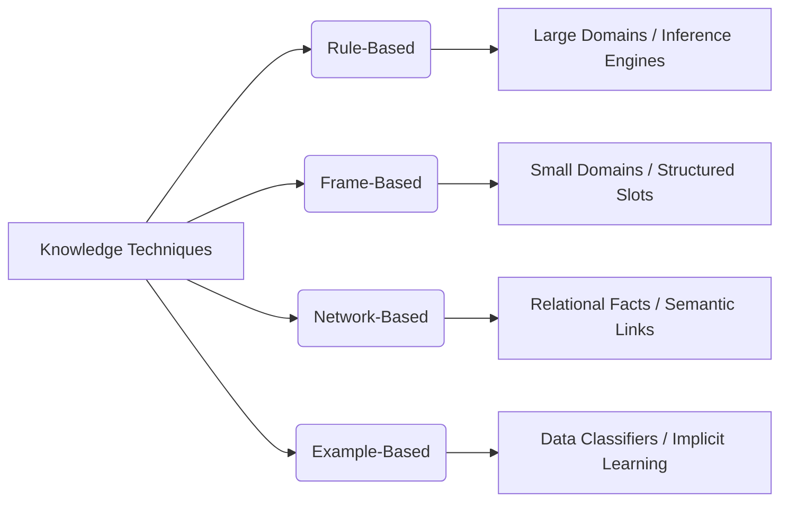

[[01. Introduction - Part 1]] [[02. Introduction - Part 2]] [[03. Introduction - Part 3]]

> [!abstract] Executive Summary & TL;DR
> User support is a foundational pillar of Human-Computer Interaction (HCI) that bridges the cognitive and technical gap between the software architect's mind and the everyday user. Far from being a mere afterthought or "add-on," effective support systems must be integrally designed from the inception of an application. They must reconcile the reality that users only seek help when they are already experiencing friction or failure. This comprehensive guide details the types, requirements, implementation paradigms, and modern adaptive knowledge representation models required to design robust, unobtrusive user assistance frameworks.

---
## 1. Fundamental Philosophy & Evolutionary Issues

The creation of any software application involves a fundamental asymmetry: the system is designed and built by a <span style="color: #1e88e5; font-weight: bold;">technically superior mind</span> relative to the ultimate end-user. As a designer or software engineer, you possess complete domain expertise, structural knowledge, and advanced cognitive understanding of the application's internal mechanics. However, end-users are not software engineers, programmers, or professional system designers—they are simply individuals attempting to execute a task.

When an application features a highly mature, standardized, and intuitive user-centered design, users embrace it organically. In an ideal ecosystem where interfaces align flawlessly with user mental models, the explicit need for user support is minimized. 

Historically, explicit "Help and Support" modules were considered absolute requirements in early heuristics (such as those by Jakob Nielsen and Ben Shneiderman). Over time, as interaction design patterns became globally standardized (e.g., standard web browser interactions, uniform windowing paradigms), explicit help menus began to recede or transform into contextual overlays. This transformation occurred because basic system functions became so normalized that explicit instructions became redundant for standard operations. However, when software introduces advanced workflows, intricate data streams, or custom corporate logic, robust user support resurfaces as an indispensable component.

### Help vs. Documentation: The Core Division
While often conflated, help and documentation serve distinct psychological and operational roles:
* <span style="color: #1e88e5; font-weight: bold;">Help:</span> This is explicitly <span style="color: #e53935; font-weight: bold;">problem-oriented and specific</span>. It is an immediate tactical intervention targeted at resolving a concrete operational block when a user encounters a roadblock.
* <span style="color: #1e88e5; font-weight: bold;">Documentation:</span> This is <span style="color: #8e24aa; font-weight: bold;">system-oriented and general</span>. It provides a holistic, systemic overview of the application's entire capability landscape, detailing features, configurations, and architecture.

Despite these differences, the identical core interaction design principles govern both components.

> [!question] FAQ: Primary Types and Issues Regarding User Support
> <span style="font-weight: bold;">Q: What are the primary types and issues regarding user support?</span>
> <span style="font-weight: bold;">A:</span> User support must be carefully designed because both its implementation and presentation are vital, and users require different types of support depending on the time. The main types of support are quick reference, task-specific help, full explanations, and tutorials.

> [!question] FAQ: Help vs. Documentation
> <span style="font-weight: bold;">Q: Is there a difference between help and documentation?</span>
> <span style="font-weight: bold;">A:</span> Yes, help tends to be problem-oriented and specific, whereas documentation is generally system-oriented and broader. However, the same design principles apply to both systems.

The standard spectrum of user support manifests across four primary timelines and depths:
1. <span style="font-weight: bold; color: #1e88e5;">Quick Reference:</span> Rapid, low-friction lookups of specific syntax, shortcuts, or commands.
2. <span style="font-weight: bold; color: #1e88e5;">Task-Specific Help:</span> Contextual aid tailored to completing a singular, immediate task currently in focus.
3. <span style="font-weight: bold; color: #1e88e5;">Full Explanation:</span> Comprehensive deep dives into the systemic behavior or systemic logic underlying a collection of features.
4. <span style="font-weight: bold; color: #1e88e5;">Tutorial:</span> Linear, step-by-step onboarding tracks designed to guide a novice user through the foundational paradigms of an application within a safe sandbox environment.

---

## 2. Core Requirements for Effective User Support

To ensure user support effectively reduces user frustration rather than exacerbating it, the system must satisfy six strict engineering and design requirements.

```mermaid
graph TD
    A[User Support Requirements] --> B(Availability)
    A --> C(Accuracy & Completeness)
    A --> D(Consistency)
    A --> E(Robustness)
    A --> F(Flexibility)
    A --> G(Unobtrusiveness)

    B --> B1[Continuous, concurrent execution]
    C --> C1[Matches actual system behavior]
    D --> D1[Unified across digital & paper mediums]
    E --> E1[Valid error handling under edge-case inputs]
    F --> F1[Adapts to novice vs. expert workflows]
    G --> G1[Does not disrupt primary task focus]
````

- Availability: The user must have continuous, uninterrupted access to the support architecture. It must run concurrently alongside the main application, ensuring that users never have to close or suspend their active work state to seek guidance.
    
- Accuracy and Completeness: The assistance material must perfectly map to the absolute current state of the live application. Version mismatches—where a help file describes an outdated button placement or an obsolete parameter sequence—completely destroy user trust. It must comprehensively cover all documented system behaviors.
    
- Consistency: All aspects of the help ecosystem—including structural terminology, layout styles, visual cues, pop-up behaviors, and printed or physical paper manuals—must employ a unified language and layout framework.
    
- Robustness: Because users exclusively turn to help systems when they are confused or experiencing system failure, the support interface must be highly resilient. It must feature flawless error handling and remain entirely predictable, even when the user behaves chaotically or inputs highly erratic commands.
    
- Flexibility: The support framework must dynamically adjust its interaction model to match the explicit experience level and immediate task posture of the user. It should offer highly rapid, low-text pathways for power users, while providing deeper informational scaffolding for novices.
    
- Unobtrusiveness: The support system must never disrupt, hijack, or block the primary interaction workspace. It must quietly coexist, allowing the user to seamlessly reference instructions while simultaneously performing actions in the core application space.
    

> [!warning] Important: The Psychology of the Frustrated User
> 
> From an industrial perspective, no user reads a help file for leisure or proactively studies documentation before using a system. Users interact with support files because they are already in trouble.
> 
> When a user opens a support interface, they are typically anxious or frustrated. In this compromised cognitive state, design flaws are amplified. Do not overwhelm them with complex technical jargon or rigid errors. The system should act as an empathetic, direct, and stable guide.

> [!question] FAQ: Key Requirements for User Support
> 
> Q: What are the key requirements for effective user support?
> 
> A: Effective user support systems must meet several requirements:
> 
> - Availability: Access should be continuous and concurrent to the main application.
>     
> - Accuracy and completeness: It must cover and match the actual behavior of the system.
>     
> - Consistency: Different parts of the help system and paper materials must be consistent.
>     
> - Robustness: The system should handle correct error handling and unpredictable user behavior.
>     
> - Flexibility: It should adapt to allow interactions appropriate for the user's experience and the specific task.
>     
> - Unobtrusiveness: The support system should not prevent the user from continuing their work.
>     

---

## 3. Standard Approaches to User Support

Engineers deploy various architectural approaches to deliver user support, ranging from command-line tools to active automated monitoring.

### A. Command Assistance

This represents a primitive yet highly efficient form of support. The user explicitly and intentionally issues a request for information regarding a highly specific command.

- Examples: The classic `man` pages in UNIX environments or the `help` utility within DOS.
    
- Pros: Exceptional for immediate, rapid syntax lookups and quick reference by experienced practitioners.
    
- Cons: Suffers from a severe baseline assumption—it assumes the user already knows exactly what command or keyword they are looking for. It offers no exploratory discovery path for novice users.
    

### B. Command Prompts

Command prompts provide immediate, reactive technical hints regarding proper parameters or functional syntax precisely when an error occurs.

- Pros: Highly effective for catching and correcting basic syntax errors or missing arguments in real-time.
    
- Cons: Like command assistance, it assumes prior knowledge of the underlying command family and fails to assist with broader task-level confusion.
    

### C. Context-Sensitive Help

This model dynamically analyzes the active interaction context of the user workspace. When support is triggered, the system interprets the request based on the specific UI element, window, or field currently focused.

- Examples: Modern desktop and web hover-tooltips that display small informational balloons explaining button behavior.
    

### D. On-Line Tutorials

Tutorials provide structured, dedicated training spaces where users step through the absolute basics of a system using simulated, non-destructive environments.

- Pros: Minimizes real-world risk, allowing users to safely build mental models of complex procedures.
    
- Cons: These paths are frequently rigid and linear. If a user's real-world problem deviates slightly from the tutorial template, the tutorial cannot dynamically adjust.
    

### E. On-Line Documentation

This approach takes comprehensive paper manuals and transfers them directly into the digital computing environment, rendering them permanently accessible within a shared medium.

- Cons: Raw text blocks from physical documentation can be dense and difficult to read or scan on digital monitors.
    
- Design Fix: Modern implementations extensively utilize hypertext linking structures to break up linear text blocks and support rapid, non-linear browsing.
    

### F. Wizards and Assistants

Wizards and assistants introduce active automation and guidance into user workflows.

- Wizards: A task-specific tool that actively guides the user through an execution path step-by-step. It structures the process by prompting the user for specific answers to targeted questions, then automatically handles the underlying technical execution.
    
    - Example: An automated resume builder or step-by-step software installation manager.
        
    - Critical Design Rule: A wizard must provide a clear pathway to go back to previous screens to modify parameters without destroying current input data. It is excellent for rare or highly complex tasks, though it severely limits operational flexibility.
        
- Assistants: Autonomous background entities that actively monitor user input patterns and dynamically provide contextual tips or structural corrections.
    

> [!danger] Failure Case: The Infamous Microsoft Clippy (MS Paperclip)
> 
> Released in the early 2000s, the Microsoft Office Paperclip assistant represents a classic failure mode for automated user support. It routinely violated the requirement of **unobtrusiveness**.
> 
> While working on a document, this automated assistant would interrupt the workflow by tapping on the screen and initiating distracting animations to ask basic, obvious questions (e.g., _"It looks like you are writing a letter, would you like help?"_). While novel at first, it quickly became highly intrusive during serious work. As a result, Microsoft removed the feature by 2003. Modern systems must ensure assistants remain under strict user control and execute tasks quietly (such as modern smart tags).

> [!question] FAQ: Standard Approaches to User Support
> 
> Q: What are the standard approaches to providing user support?
> 
> A: Standard approaches include:
> 
> - Command assistance: Used for quick references when a user requests help on a specific command (like DOS help or UNIX man), assuming the user knows what to look for.
>     
> - Command prompts: Best for simple syntactic errors, this provides information on correct usage when an error occurs, assuming the user has knowledge of the command.
>     
> - Context-sensitive help: Interprets the user's help request based on the current context, such as with tooltips.
>     
> - On-line tutorials: Allows the user to learn application basics within a test environment, though these can often be inflexible.
>     
> - On-line documentation: Provides continuous access to paper documentation on the computer; hypertext is often used to make browsing easier.
>     
> - Wizards: Task-specific tools that use specific questions to guide a user step-by-step through complex or infrequent tasks (e.g., writing a resume), though they limit flexibility and must allow the user to go back.
>     
> - Assistants: Tools that monitor user behavior to provide contextual advice (e.g., XP smart tags); these must be under user control because they can be irritating, like the MS paperclip.
>     

---

## 4. Adaptive Help Systems

Adaptive Help Systems represent an advanced paradigm in user support. Rather than presenting generic text to every user, these engines use context, individual user profiles, specific task goals, domain knowledge, and instructional strategies to dynamically tailor assistance to the user's immediate needs.

```mermaid
graph TD
    ContextModel[Context Model] --> AdaptiveEngine(Adaptive Engine)
    TaskModel[Task Model] --> AdaptiveEngine
    UserModel[User Model] --> AdaptiveEngine
    DomainModel[Domain Model] --> AdaptiveEngine
    AdaptiveEngine --> TailoredOutput[Tailored Help Output]
```

### Core Challenges & Design Questions

Developing an adaptive help platform introduces significant engineering and architectural challenges:

1. Knowledge Requirements: The volume of telemetry and data modeling needed to dynamically predict user needs is massive. System designers must map out and anticipate hundreds of distinct user variations.
    
2. Locus of Control: Who holds structural command over the interaction—the machine or the user? If the system controls the flow, it can enforce rigid pathways to keep the user on track. If the user retains control, the help engine must dynamically adapt to highly unpredictable behaviors.
    
3. Target of Adaptation: What specific elements should change? Should the system modify the interface layout, alter the language phrasing, or provide alternative command selections?
    
4. Scope of Adaptation: Should the system adapt locally within a single specific tool, or globally across the entire operating ecosystem? Global adaptation is far more complex, as user expertise often varies widely between different application modules.
    

> [!question] FAQ: Adaptive Help Systems and Challenges
> 
> Q: What are Adaptive Help Systems and what challenges do they face?
> 
> A: Adaptive help systems aim to provide customized help by using knowledge of the individual user, context, task, domain, and instruction. They face considerable problems, including massive knowledge requirements, determining what exactly should be adapted, the scope of the adaptation, and deciding whether the user or the system controls the interaction.

---

## 5. User Modeling & Knowledge Representation

Every modern user support framework relies on an underlying model of the user. These models generally fall into one of three architectural tiers:

|**Model Tier**|**Configuration Type**|**System Nature**|**Architectural Complexity**|
|---|---|---|---|
|Single, Generic Model|Static|Non-Intelligent|Baseline. Treats every single user as an identical persona with uniform capabilities.|
|User-Configured Model|Adaptable|User-Driven|Medium. Allows the user to manually adjust preferences, settings, and support levels.|
|System-Configured Model|Adaptive|Data-Driven / Intelligent|High. Automatically monitors usage history and telemetry to dynamically adapt the system.|

> [!example] Real-World Example: Dynamic Target Advertising
> 
> A clear example of an adaptive system is Google or Facebook's search tracking ecosystem. If you search for cake recipes on a browser, your social media feeds automatically adapt within minutes to display local bakery ads or cake delivery options. This uses a data-driven system-configured adaptive model.

### Approaches to Structural User Modeling

#### 1. Quantification

This approach calculates user proficiency by tracking quantitative usage metrics. It monitors behavioral data—such as menus accessed, error frequencies, and execution speeds—to move the user along a spectrum of expertise levels.

#### 2. Stereotypes

This method uses categorization to map users into predefined personas or baseline archetypes from the start.

- Example: Categorizing a user group based on their institution or role, such as classifying users as "Computer Science Engineering Students."
    

> [!info] Analogy: Sitcom Stereotypes
> 
> Think of the classic British television sitcom "Mind Your Language". The show relies on distinct national archetypes (e.g., characters from different countries continuously clashing or displaying highly exaggerated, predictable behaviors).
> 
> In software design, using archetypes or stereotypes provides a highly effective starting blueprint for user requirements. However, designers must ensure the software remains flexible enough to accommodate individual user variations that deviate from the baseline stereotype.

#### 3. Overlay Modeling

This paradigm constructs a highly optimized, idealized model of an expert user. The system continuously tracks live user interactions and overlays them against this expert template to identify variations, gaps, or structural inefficiencies.

- Special Case Validation: The system can compare user behaviors directly against a known error catalogue. If the user's input sequence matches a documented error pattern, the system can instantly deploy targeted, preventative corrections.
    

> [!question] FAQ: Help Systems and User Modeling
> 
> Q: How do help systems model the user?
> 
> A: Every help system contains a user model, which could be a single/generic non-intelligent user, a user-configured adaptable model, or a system-configured adaptive model. Specific approaches to user modeling include:
> 
> - Quantification: Moving the user between expertise levels based on quantitative measures of their knowledge.
>     
> - Stereotypes: Classifying the user into a particular predefined category.
>     
> - Overlay: Constructing an idealized expert model and comparing it to the user's actual behavior to find commonalities or differences, sometimes comparing behavior against a known error catalogue.
>     

---

## 6. Domain, Task, and Advisory Modeling

### Domain and Task Modeling

This engine maintains a detailed structural model of the system's operational domains, typical workflows, and common user errors. It continuously reviews the user's active command sequences to interpret their current state.

> [!bug] Technical Boundary Conditions: The Intent Gap
> 
> Tracking and modeling user workflows introduces three major technical challenges:
> 
> 1. Task Representation: Defining and updating multifaceted real-world tasks within software logic is highly complex.
>     
> 2. Interleaved Tasks: Users rarely complete workflows in a perfectly linear fashion. They frequently jump between tasks, pause operations, switch contexts, and resume older processes later.
>     
> 3. User Intention: A system can track exact inputs, but it cannot directly read the user's underlying mental intent.
>     

> [!example] Software Evaluation: Standard Calculator App
> 
> When evaluating a basic calculator application, a normal user inputs numbers, selects an operator, and hits the equals sign to complete a calculation. Their intent is straightforward.
> 
> However, an interface evaluator or software tester has a completely different intent: to stress-test the system's boundaries. A tester might enter complex sequences like `A + 5 =` or input invalid dates like `00` or negative values. If the application assumes a uniform, simple user intent, it will choke on these inputs. Designers must build systems that handle edge cases safely, recognizing that intentions shift depending on the context.

### Advisory Strategies

Advisory modeling selects the most appropriate style, presentation, and tone of advice for a given situation. It determines whether the system should offer a quiet, passive reminder or deploy a comprehensive, interactive tutorial sequence. While few intelligent systems fully automate this choice, selecting the right advisory style remains a key factor in keeping users engaged.

> [!question] FAQ: Domain, Task, and Advisory Strategy
> 
> Q: How is the domain, task, and advisory strategy modeled?
> 
> A: Domain and task modeling covers the current task and common errors, usually by analyzing the sequence of commands. This involves difficulties in representing tasks, dealing with interleaved tasks, and understanding user intentions. Advisory strategy involves choosing the right style of advice (such as a reminder or a tutorial) for a specific situation.

---

## 7. Knowledge Representation Techniques

To successfully store, organize, and interpret data for user support, engineers leverage four primary knowledge representation architectures.



### 1. Rule-Based Systems

Knowledge is explicitly organized as an array of discrete rules and facts (e.g., standard conditional logic, production statements). The application interprets user actions by evaluating them through an internal inference mechanism.

- Pros: Scales effectively to accommodate relatively large and complex operational domains.
    

### 2. Frame-Based Systems

Knowledge is partitioned into structural entities called frames. Each frame contains a collection of specific attributes or "slots" that must be systematically populated with relevant user context data.

- Pros: Highly organized and effective for managing smaller, distinct application domains.
    

### 3. Network-Based Systems

This paradigm maps knowledge as a web of explicit relationships connecting disparate data facts or frames (resembling a classic semantic network grid). It is highly effective for linking related frames together across broad informational graphs.

### 4. Example-Based Systems

Rather than using explicitly coded programmatic rules, these frameworks embed knowledge implicitly within a structural decision engine. The module is trained on historical data to classify user behaviors rather than being statically programmed.

- Pros: Requires very little explicit, manual knowledge acquisition from developers.
    

### Summary of Representation Obstacles

Regardless of the architectural choice, designers face three persistent challenges:

- Knowledge Acquisition: Extracting accurate procedural rules requires extensive workshops, interview panels, and stakeholder alignment sessions to capture design intent cleanly.
    
- Resource Overhead: Managing complex user logic models consumes significant execution power, memory, and screen space.
    
- Behavioral Interpretation: Correctly translating a user's erratic mouse path or input sequence into a clear technical need remains a difficult challenge.
    

> [!question] FAQ: Techniques for Knowledge Representation
> 
> Q: What techniques are used for knowledge representation?
> 
> A:
> 
> - Rule-based: Uses logic or production rules interpreted by an inference mechanism, which is effective for relatively large domains.
>     
> - Frame-based: Stores knowledge in structures with fillable slots, like a semantic network, which is useful for smaller domains.
>     
> - Network-based: Represents knowledge as relationships between facts and can be used to link frames together.
>     
> - Example-based: Trains the system to classify information within a decision structure, which requires little knowledge acquisition because knowledge is represented implicitly.
>     

> [!question] FAQ: Overarching Problems in Adaptive Help
> 
> Q: What are the overarching issues in adaptive help and knowledge representation?
> 
> A: Key problems with modeling include the resources required, acquiring the knowledge itself, and correctly interpreting the user's behavior. When developing adaptive help, designers must resolve:
> 
> - Initiative: Whether the system can interrupt the user to offer help, or if the user retains control.
>     
> - Effect: Identifying exactly what information is needed so the system only models what is strictly necessary to adapt.
>     
> - Scope: Deciding if the modeling happens at the application level or the more complex system level, since user expertise varies between different applications.
>     

---

## 8. Designing and Presenting User Support

### Core Integration Principles

User support must never be treated as an isolated addition or an afterthought at the end of the development lifecycle. It should be designed as an integral, core component of the system architecture from the beginning.

When building help systems, focus on the fundamental content and context of the assistance rather than over-engineering complex technical delivery tools.

> [!example] Process Comparison: Google Drive Downloads
> 
> Consider the engineering workflow for a Google Drive file download. The technical process—handling server pipelines, routing data packets, and tracking download percentages—is purely mechanical.
> 
> However, an effective user support system ignores these low-level technological details. Instead, it focuses on the user's context: why and when does a user need to download this file? It then demonstrates the process through clear visual paths, simple workflow animations, or short video guides.

### Presentation Design Decisions

- Request Triggers: How does a user ask for help? Designers must choose clear triggers, such as keyboard commands, explicit help buttons, dedicated function hotkeys, or opening an isolated standalone support window.
    
- Display Paradigms: Where does the help content appear? Options include launching a new window, utilizing a split-screen layout, opening a localized pop-up box, or showing subtle hint icons.
    

### Effective Content Presentation Rules

To ensure readability when a user is under cognitive stress, presentation layers must strictly follow three guidelines:

1. Use language that is clear, familiar, consistent, and instructional. Tell the user exactly what action to take rather than simply providing a dry, technical description of the system's state. Avoid confusing technical jargon.
    
2. Avoid large blocks of text. Walls of dense text overwhelm anxious users, causing them to lose focus. Use bulleted lists and clean formatting.
    
3. Provide immediate, highly legible visual signposts for summaries and clear practical examples.
    

> [!question] FAQ: Designing and Presenting User Support
> 
> Q: What should be kept in mind when designing and presenting user support?
> 
> A: User support is not an "add on" and must be integrally designed alongside the core system, focusing on the content and context of the help rather than just the technology. For presentation, designers must decide how help is requested (e.g., via button, command, or separate app) and how it is displayed (e.g., split screen, pop-up boxes, or new windows). An effective presentation requires clear, consistent, and familiar instructional language, clear indications of examples and summaries, and the avoidance of large text blocks.

---

## 9. Structural Implementation Issues

When building a user support architecture, developers must address several core backend implementation questions:

### 1. Architectural Placement

Where does the support framework run? Designers must decide if help operates as a low-level operating system command, a high-level meta command, or an independent application layer.

### 2. Data Structure Paradigms

How is the underlying support information stored and searched?

- Single File: A basic, unified flat file. Simple to deploy, but difficult to scale or maintain.
    
- File Hierarchy: Structured directory trees that organize support data into clear sub-topics.
    
- Database: A relational or non-relational storage engine that enables robust, complex search queries and dynamic content delivery.
    

### 3. Resource & Operational Constraints

- System Resource Management: The help interface must maintain a lightweight footprint, ensuring it does not consume critical screen space, system memory capacity, or processor execution speeds.
    
- System Growth & Usability: The storage structure must scale smoothly to support flexible browsing, easy data extensibility, clear navigation searches, and convenient printing for physical hard copies.
    

> [!question] FAQ: Implementation Issues
> 
> Q: What are the implementation issues regarding user support?
> 
> A: When implementing user support, one must decide whether the help acts as an operating system command, a meta command, or an application. Data structure must be determined (single file, database, or file hierarchy), alongside managing available resources like memory capacity, speed, and screen space. Additionally, designers have to consider browsing functionality, extensibility, flexibility, and the availability of hard copy documentation.

> [!tip] Summary Insight
> 
> Your user support framework is your absolute last resort to ensure a user has a positive experience with your system. If an application features design flaws, a poorly implemented, confusing, or inaccurate help file will only increase user frustration. Designing support correctly from day one turns an anxious user into an empowered, satisfied customer.
